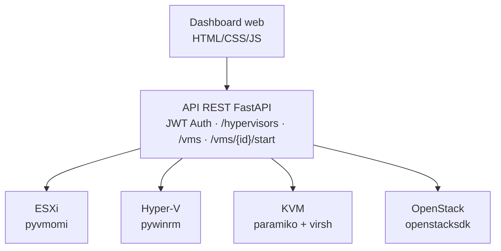

# Hybrid Hypervisor Management Platform

Plateforme d'administration unifiée pour infrastructure de virtualisation hétérogène (VMware ESXi, Microsoft Hyper-V, KVM) et cloud privé OpenStack, conçue pour démontrer une maîtrise pratique de l'administration systèmes multi-hyperviseurs et du développement d'API.

## Le problème

Une infrastructure d'entreprise mélange rarement un seul hyperviseur. Entre héritage technique, coûts de licence et choix historiques, il est courant de trouver VMware ESXi, Microsoft Hyper-V et KVM/Linux qui cohabitent, chacun avec sa propre API, son propre outillage, sa propre logique de gestion.

Ce projet construit une API REST unique qui abstrait ces différences et expose une interface commune pour lister, démarrer, arrêter et créer des VMs, quel que soit l'hyperviseur sous-jacent — avec un dashboard web complet par-dessus.

## Phases du projet

| Phase | Contenu | Statut |
|---|---|---|
| 1 | Étude de l'architecture cible | ✅ |
| 2 | Déploiement des hyperviseurs (ESXi, Hyper-V, KVM) en virtualisation imbriquée | ✅ |
| 3 | Configuration réseau et DNS (`lab.local`) | ✅ |
| 4 | Stockage partagé NFS (datastore ESXi, lecteur réseau Hyper-V) | ✅ |
| 5 | Backend FastAPI unifiant les 4 hyperviseurs (ESXi, Hyper-V, KVM, OpenStack/DevStack) | ✅ |
| 6 | Authentification JWT, création de VM depuis l'API, dashboard web, export CSV | ✅ |
| 7 | Suppression et modification de VM, panneau de paramètres, RBAC simplifié | 🔜 |

## Architecture



Chaque hyperviseur est piloté par un connecteur dédié qui implémente une interface commune (`HypervisorConnector`), permettant à l'API de traiter tous les hyperviseurs de façon polymorphe, sans jamais savoir, dans le code des routes, à quel hyperviseur elle parle réellement.

## Stack technique

- **Backend** : Python 3.11, FastAPI, Pydantic, SQLite
- **Frontend** : HTML/CSS/JS natif (sans framework), dashboard responsive avec thème clair/sombre
- **Authentification** : JWT/OAuth2, mots de passe hashés (bcrypt)
- **Connecteurs** : pyvmomi (ESXi), pywinrm (Hyper-V), paramiko+virsh (KVM), openstacksdk (OpenStack)
- **Infrastructure** : VMware Workstation (nested virtualization), DNS via Windows Server, stockage partagé NFS
- **Cloud privé** : DevStack (Keystone, Nova, Neutron, Glance, Placement)

## Démarrage rapide

```bash
git clone https://github.com/RahmaHaouas/hybrid-hypervisor-management-platform.git
cd hybrid-hypervisor-management-platform
python -m venv venv
venv\Scripts\activate
pip install -r requirements.txt
cp .env.example .env
uvicorn app.main:app --reload
```

Dashboard web : `http://127.0.0.1:8000`
Documentation API interactive : `http://127.0.0.1:8000/docs`

## Endpoints

| Méthode | Route | Description |
|---|---|---|
| POST | `/token` | Authentification, retourne un token JWT |
| GET | `/hypervisors` | Liste les hyperviseurs configurés et leur disponibilité |
| GET | `/vms` | Liste toutes les VMs, tous hyperviseurs confondus |
| GET | `/vms/{hypervisor}` | Liste les VMs d'un hyperviseur précis |
| POST | `/vms/{hypervisor}` | Crée une VM sur l'hyperviseur indiqué |
| POST | `/vms/{hypervisor}/{vm_id}/start` | Démarre une VM |
| POST | `/vms/{hypervisor}/{vm_id}/stop` | Arrête une VM |
| GET | `/uptime` | Historique de disponibilité des hyperviseurs |
| GET | `/activity-log` | Journal des actions effectuées |
| GET | `/activity-log/export` | Export du journal au format CSV |

## Support de la création de VM par hyperviseur

| Hyperviseur | Création de VM | Détail |
|---|---|---|
| KVM | ✅ Fonctionnel | Clone d'une image qcow2 template, réseau `default` via libvirt |
| OpenStack | ✅ Fonctionnel | Via Nova/Neutron/Glance (image, flavor, réseau paramétrables) |
| Hyper-V | ✅ Fonctionnel | Clone d'un VHDX template, switch réseau `vSwitch-External` |
| ESXi | ⚠️ Non disponible | Licence gratuite/standalone restreinte par VMware (`RestrictedVersion`) — nécessiterait vCenter |

## Ce que ce projet couvre (et ne couvre pas encore)

**Fonctionnel et testé** :
- Lecture et contrôle start/stop sur les 4 hyperviseurs
- Création de VM sur KVM, OpenStack et Hyper-V, avec formulaire web adaptatif selon l'hyperviseur choisi
- Authentification JWT sur l'ensemble de l'API
- Isolation des pannes : un hyperviseur injoignable n'empêche pas les autres de répondre
- Journal d'activité complet (qui, quoi, quand, résultat) avec export CSV
- Historique de disponibilité des hyperviseurs (health checks automatiques toutes les 60s)

**Non couvert pour l'instant, prévu en Phase 7** :
- Suppression de VM (`delete_vm`)
- Modification de VM existante — redimensionnement RAM/vCPUs (`resize_vm`)
- Gestion des rôles utilisateurs (RBAC) — actuellement un seul compte administrateur
- Panneau de paramètres (intervalle du scheduler configurable depuis l'interface)
- Monitoring détaillé (CPU/RAM/disque en temps réel par VM) — envisagé en phase ultérieure

## Points techniques notables

- **Sécurité** : validation stricte des noms de VM (regex) sur tous les connecteurs pour prévenir l'injection de commandes shell/PowerShell ; secrets exclusivement en variables d'environnement, jamais commités
- **Robustesse réseau** : chaque connecteur ouvre une connexion fraîche par appel plutôt que de partager un état de session entre threads, évitant les erreurs intermittentes de concurrence (notamment observé et corrigé sur le connecteur Hyper-V/WinRM)
- **Gestion d'erreurs cohérente** : `ValueError` → HTTP 400, `NotImplementedError` → HTTP 501, avec messages explicites remontés jusqu'à l'interface utilisateur