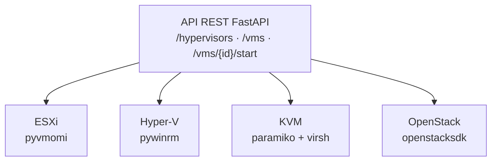

# Hybrid Hypervisor Management Platform

Plateforme d'administration unifiée pour infrastructure de virtualisation hétérogène (VMware ESXi, Microsoft Hyper-V, KVM) et cloud privé OpenStack, conçue pour démontrer une maîtrise pratique de l'administration systèmes multi-hyperviseurs et du développement d'API.

## Le problème

Une infrastructure d'entreprise mélange rarement un seul hyperviseur. Entre héritage technique, coûts de licence et choix historiques, il est courant de trouver VMware ESXi, Microsoft Hyper-V et KVM/Linux qui cohabitent, chacun avec sa propre API, son propre outillage, sa propre logique de gestion.

Ce projet construit une API REST unique qui abstrait ces différences et expose une interface commune pour lister, démarrer et arrêter des VMs, quel que soit l'hyperviseur sous-jacent.

## Phases du projet

| Phase | Contenu | Statut |
|---|---|---|
| 1 | Étude de l'architecture cible | ✅ |
| 2 | Déploiement des hyperviseurs (ESXi, Hyper-V, KVM) en virtualisation imbriquée | ✅ |
| 3 | Configuration réseau et DNS (`lab.local`) | ✅ |
| 4 | Stockage partagé NFS (datastore ESXi, lecteur réseau Hyper-V) | ✅ |
| 5 | Backend FastAPI unifiant les 3 hyperviseurs + connecteur OpenStack (DevStack) | ✅ |
| 6 | Authentification API, création de VM depuis l'API, tests automatisés | 🔜 |
## Architecture



Chaque hyperviseur est piloté par un connecteur dédié qui implémente une interface commune (`HypervisorConnector`), permettant à l'API de traiter tous les hyperviseurs de façon polymorphe, sans jamais savoir, dans le code des routes, à quel hyperviseur elle parle réellement.

## Stack technique

- **Backend** : Python 3.11, FastAPI, Pydantic
- **Connecteurs** : pyvmomi (ESXi), pywinrm (Hyper-V), paramiko+virsh (KVM), openstacksdk (OpenStack)
- **Infrastructure** : VMware Workstation (nested virtualization), DNS via Windows Server, stockage partagé NFS
- **Cloud privé** : DevStack (Keystone, Nova, Neutron, Glance, Placement)

## Démarrage rapide

```bash
git clone https://github.com/RahmaHaouas/hybrid-hypervisor-management-platform.git
cd hybrid-hypervisor-management-platform
python -m venv venv
venv\Scripts\activate
pip install -r requirements.txt
cp .env.example .env
uvicorn app.main:app --reload
```

Documentation API interactive : `http://127.0.0.1:8000/docs`

## Endpoints

| Méthode | Route | Description |
|---|---|---|
| GET | `/hypervisors` | Liste les hyperviseurs configurés et leur disponibilité |
| GET | `/vms` | Liste toutes les VMs, tous hyperviseurs confondus |
| GET | `/vms/{hypervisor}` | Liste les VMs d'un hyperviseur précis |
| POST | `/vms/{hypervisor}/{vm_id}/start` | Démarre une VM |
| POST | `/vms/{hypervisor}/{vm_id}/stop` | Arrête une VM |

## Ce que ce projet couvre (et ne couvre pas encore)

Fonctionnel et testé : lecture et contrôle start/stop sur les 4 hyperviseurs, isolation des pannes (un hyperviseur injoignable n'empêche pas les autres de répondre).

Non couvert pour l'instant : création de VM depuis l'API, gestion du stockage/réseau par hyperviseur, authentification sur l'API elle-même (prévu comme prochaine étape).